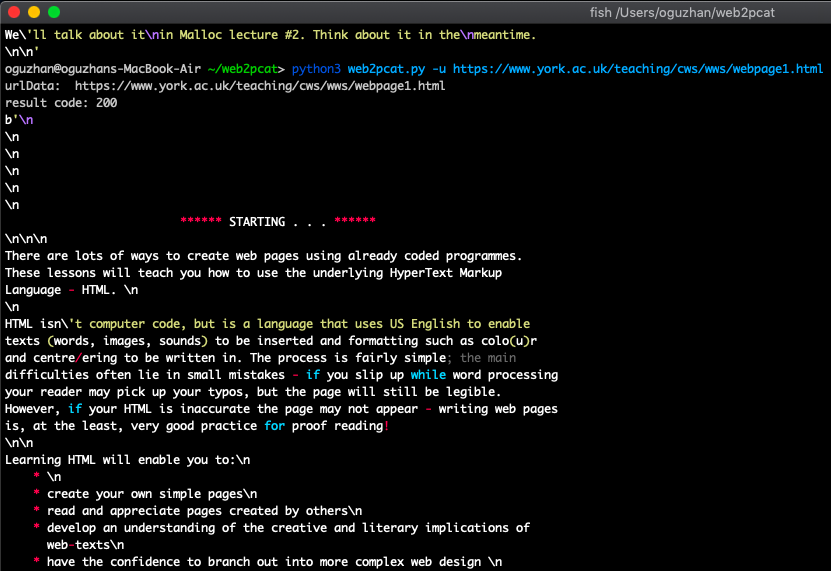

[](https://circleci.com/gh/oguzhanlarca/web2pcat/tree/master) [](https://github.com/oguzhanlarca/web2pcat)

> its not for any html docs it is for [James S. Plank](http://web.eecs.utk.edu/~plank/) and his cs360 [lecture notes](http://web.eecs.utk.edu/~plank/plank/classes/cs360/lecture_notes.html) and [exams](http://web.eecs.utk.edu/~plank/plank/classes/cs360/tests.html)

> ``` html2text lecture.html | pygmentize > lecture.txt ```

## Prerequisites
*   Python 2.7 & Python 3.7.4 64-bit or greater
*   The pip & pip3.7 package management tool or greater

## Dependencies (Homebrew/Linuxbrew)
```
$ brew install python
$ brew unlink python && brew link --overwrite python # make sure python links to python2
$ pip2 install --upgrade pip setuptools # upgrade to latest pip2
$ pip2 install pygments
$ brew install html2text
```
## Suggestion
```
$ alias pcat='pygmentize -f terminal256 -O style=monokai -g'
```
## Installation
```
$ git clone https://github.com/oguzhanlarca/html2pcat.git
$ cd html2pcat
$ mkdir bin build
$ make
$ make install
$ html2pcat
```
### Manuel Installation in bash shell
```
$ gcc -o html2pcat pretty.c
$ chmod a+x html2pcat
```
## Upgrade later
```
$ pip3 install pygments --upgrade
$ brew upgrade html2text
```
## Screenshot

